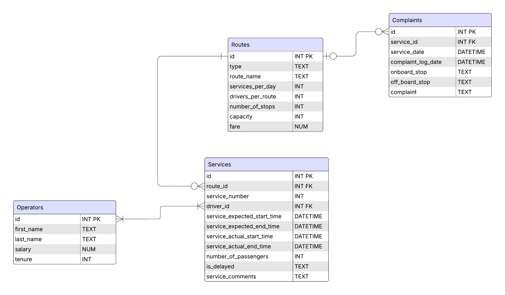

# edX-SQL-Final-Project
This repository contains the .md and .sql files submitted for my final project in relations to edX HarvardX CS50's Introduction to Databases with SQL certificate course.

# Design Document

By Ceara Stewart

Video overview: [<(https://youtu.be/wYybmFPrVMw)>]

## Scope

This database for CS50 SQL includes all entities necessary to facilitate the process of tracking Septa public transportation service cuts. For contextual background information, the city of Philadelphia, PA has a variety of public transport options, called Septa, that enable its citizens and tourists to converse throughout the city at reasonable prices. Due to recent budget cuts to Septa, a vast number of transportation lines are being cut, and their fair prices are increasing.

Included in the database’s scope is:
•	Service types, including basic identifying information
•	Routes, including expected and actual times, if a certain service is delayed, passenger numbers, and the service operator.
•	Operators, including basic identifying information
•	Complaints, containing the date of service the complaint is for, and the service stops involved as well as the complaint submitted.

Out of scope are elements like passenger personal information, such as their first and last names, frequency of utilizing a particular route, and any other non-core attributes.

## Functional Requirements

This database will support:
•	Tracking the effects of service decreases on route delays, profit changes, and complaint numbers.
•	Tracking service delays, including the operators for that service, and delay reasons.
•	Tracking service complaints and tying them on a particular route and operator.

## Representation

Entities are captured in SQLite tables with the following schema.

### Entities

The database includes the following entities:

Routes
The `routes` table includes:
•	`id`, which specifies the unique ID for the route as an `INTEGER`. This column thus has the `PRIMARY KEY` constraint applied.
•	`type`, which is the type of transportation the route is. It can only hold the types specified as ‘bus’, ‘subway’, ‘trolley’ or ‘rail’ and is represented as ‘TEXT` holds a `CHECK` constraint.
•	`route_name`, is the name of the route and is thus represented as `TEXT`. This should also be a unique value to ensure two routes do not hold the same name, thus a `UNIQUE` constraint should be implemented.
•	`services_per_day`, which is the number of services run on each route per day, represented as an `INTEGER`.
•	`drivers_per_route`, is the number of drivers assigned to each route and is represented as an `INTEGER`.
•	`number_of_stops`, is the number of stops each service makes on the route. It is represented by an `INTEGER`.
•	`capacity`, which is the recommended total capacity for a service on that route. It is stored as an `INTEGER`.
•	`fare`, is the cost the passenger pays to ride that route. It is a float that can contain decimals to the hundredths place and is this represented as `NUMERIC`.  A fare can also not be 0 so there is a `CHECK` constraint where `fare` != `0`.
All columns in the `routes` table are required and hence should have the `NOT NULL` constraint applied.

Services
The `services` table includes:
•	`id`, which specifies the unique ID for the service as an `INTEGER`. This column thus has the `PRIMARY KEY` constraint applied.
•	`route_id`, which is the ID of the route as an `INTEGER`. This column is the link to the `routes` table and thus has the `FOREIGN KEY` constraint applied, referencing the `id` column in the `routes` table to ensure data integrity.
•	`service_number`, is the number associated with the service being run at that time, i.e. the number 1 refers to the first service of that route run that day. It is represented as an `INTEGER`.
•	`driver_id`, which is the ID of the operator as an `INTEGER`. This column references the `id` column in the `operators` table and thus has the `FOREIGN KEY` constraint applied.
•	`service_expected_start_time`, represents the scheduled start time of that service number on that route established by Septa. It is a Timestamp stored as `NUMERIC` with the default value for the `started` attribute as the current timestamp, as denoted by `DEFAULT CURRENT_TIMESTAMP`.
•	`service_expected_end_time`, represents the scheduled end time of that service number on that route established by Septa. It is a Timestamp stored as `NUMERIC` with the default value for the `started` attribute as the current timestamp, as denoted by `DEFAULT CURRENT_TIMESTAMP`.
•	`service_actual_start_time`, represents the actual start time logged by the operator for that service. It has the same constraints and type as the previous two entities.
•	`service_actual_end_time`, represents the actual end time logged by the operator for that service and has the same type and constraints as `service_actual_start_time`.
•	`number_passengers`, which is the number of passengers that utilized that service. It is determined by the total number of payments made to the operator during that service. Thus, it is denoted by type `INTEGER`.
•	`is_delayed`, is whether that service was delayed and is calculated from whether `service_expected_start_time` and `service_actual_start_time` differ in value OR whether `service_expected_end_time`and `service_actual_end_time`. It is represented by either `Yes` or `No` `TEXT` values and thus holds a `CHECK` constraint.
•	`service_comments`, which are comments the operator can choose to leave after the completion of that service. The operator can enter anything they choose and thus is held as `TEXT`.

All columns except `service_comments` should contain values and thus should all hold the constraint `NOT NULL`. This is because that service doesn’t appear within the `services` table unless it was in operation and has timestamps logged. The `service_comments` column can contain `NULL` values since an operator isn’t required to leave comments following the completion of a service.

Operators
The `operators` table includes:
•	`id`, which specifies the unique ID for the operator as an `INTEGER`. This column thus has the `PRIMARY KEY` constraint applied.
•	`first_name`, which specifies the operator's first name as `TEXT`, given `TEXT` is appropriate for name fields.
•	`last_name`, which specifies the operator's last name. `TEXT` is used for the same reason as `first_name`.
•	`salary`, which specifies the operator’s yearly salary. This column is represented with a `NUMERIC` type affinity, which can store either floats or integers.
•	`tenure`, which is the total number of consecutive years the operator has been employed with Septa and is stored as an `INTEGER`.

All columns in the `operators` table are required and hence should have the `NOT NULL` constraint applied.

Complaints
The `complaints` table includes:
•	`id`, which specifies the unique ID for the complaint as an `INTEGER`. This column thus has the `PRIMARY KEY` constraint applied.
•	`service_id`, which is the ID of the route as an `INTEGER`. This column references the `id` column in the `routes` table and thus has the `FOREIGN KEY`.
•	`service_date`, which is the date of the service the passenger entered a complaint about. The hypothetical online form only allows for a numeric date to be entered so it is a Timestamp stored as `NUMERIC` with the default value for the as the current timestamp, as denoted by `DEFAULT CURRENT_TIMESTAMP`.
•	`complaint_log_date`, this is the timestamp of when the passenger submits the complaint form and is thus a Timestamp stored as `NUMERIC`. The default value is the current timestamp, as denoted by `DEFAULT CURRENT_TIMESTAMP`.
•	`onboard_stop`, which is the service stop the passenger got on at to begin their ride. It is stored as `TEXT`.
•	`off_board_stop`, which is the service stop the passenger got off at to end their ride. It is stored as `TEXT`.
•	`complaint`, which is the complaint the passenger writes about their service ride. It is stored as `TEXT`.

All columns are required and hence have the `NOT NULL` constraint applied where a `PRIMARY KEY` or `FOREIGN KEY` constraint is not.

### Relationships

The entity relationship diagram below describes the relationships among the entities in the database.

As detailed by the diagram:
•	A service can only be represented by one route, a 1-1 relationship. But one route can have many services that run along it, or 0 services if the route is discontinued.
•	An operator can operate many routes (not at the same time of course) and must operate a route to be considered employed so this is a 1-many relationships.  And the route can have many operators which is also a 1-many relationship.
•	Since a passenger must submit a new complaint for each service they rode, only one complaint can be associated with one route, a 1-1 relationship. But a route can have many, many complaints submitted regarding them, resulting in a 1-many relationship, or even 0-many if a route has 0 complaints submitted about it.

## Optimizations

I created two indexes, one that speeds up the joins between the ‘services’ and ‘routes’ tables, and the second that speeds up the joins between ‘routes’ and ‘complaints’. I decided to create these two indexes since being able to quickly pull service and complaint information is relevant to evaluating the effects of service cuts.

I created one view that captures operator performance. Being able to quickly view if operators are causing delays will allow for quicker decisions as to if a route needs a new operator to increase service times.

## Limitations

This schema currently holds a scalability limitation within the `complaints` table. Currently the complaints are tied to just the route itself, but there are instances where a passenger may leave a complaint about the operator of that route. Since a route can have many operators on a given day, the complaint table would need expansion to tie the exact service time to an operator.

The `operators` table also does not allow for historical tracking or changes. The schema only holds current values and would need to be expanded to be able to track historic data.

